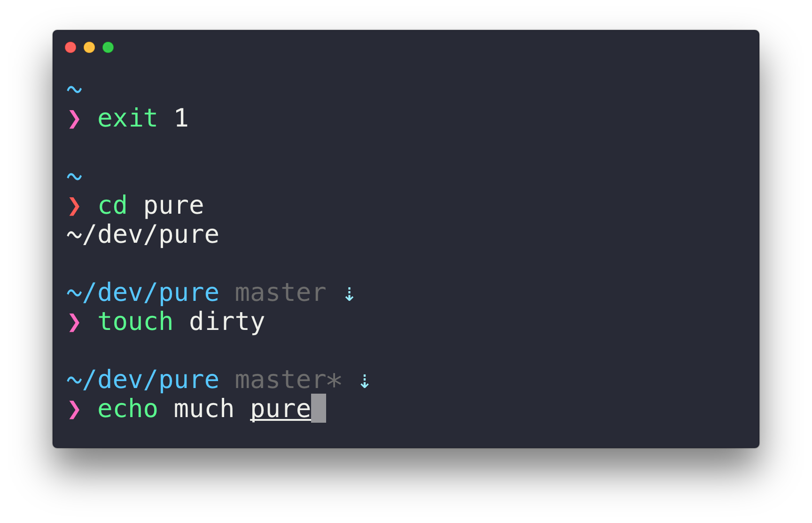

# Config

**Config** is a basic checklist I follow to set up a new Mac's development environment. It gets me up to speed with Git, GitHub, Node, and more so I can more quickly get back to coding.

## Contents

| File | Description |
| --- | --- |
| `.surge.conf` | Fuck GFW! |
| `.gitconfig` | Global Git configuration to specify my name and email, shortcuts, colors, and more. |
| `.gitignore` | The ignore file from [twbs/bootstrap](https://github.com/twbs/bootstrap) that I use everywhere. |

## Checklist

### 1. Prep OS X

- Download and install latest version of Xcode from the Mac App Store.
- Download and install Xcode Command Line Tools from <https://developer.apple.com/downloads/>.

### 2. Prep Terminal.app

- Download and Install [zsh + oh-my zsh](https://github.com/robbyrussell/oh-my-zsh)
- Install [pure](https://github.com/sindresorhus/pure),Pretty, minimal and fast ZSH prompt
- Load [`.gitconfig`](/.gitconfig) contents into the global `~/.gitconfig`

### 3. Secure Git(Hub) access

- [Generate new SSH key](https://help.github.com/articles/generating-ssh-keys/)
- [Generate an access token](https://help.github.com/articles/creating-an-access-token-for-command-line-use/) for Terminal to auth your GitHub account when 2FA is enabled.

### 4. Setup HyperTerm

- Download and install [hyper
](https://github.com/zeit/hyper)
- Install [hyper-snazzy](https://github.com/sindresorhus/hyper-snazzy)

#### look like this

### 5. Setup Atom

- Enable `atom` Terminal commands: from Atom.app, open the Atom menu and select *Install Shell Commands*
- Install [native-ui](https://atom.io/themes/native-ui) theme
- Install favorite packages
  - [atom-beautify](https://atom.io/packages/atom-beautify)
  - [emmet](https://atom.io/packages/emmet)
  - [file-icons](https://atom.io/packages/file-icons)
  - [minimap](https://atom.io/packages/minimap)
  - [autocomplete-paths](https://atom.io/packages/autocomplete-paths)
  - [docblockr](https://atom.io/packages/docblockr)
  - [trailing-spaces](https://atom.io/packages/trailing-spaces)
  - [selector-to-tag](https://atom.io/packages/selector-to-tag)

## Use it yourself

Fork this repo, or just copy-paste things you need, and make it your own. **Please be sure to change your `.gitconfig` name and email address though!**

## Works on my machine

Yup, it does. Hopefully it does on yours as well, but please don't hate me if it doesn't.
